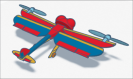
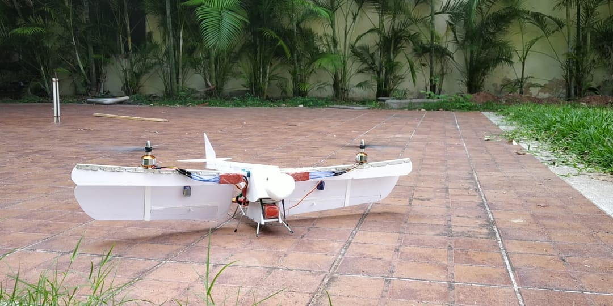
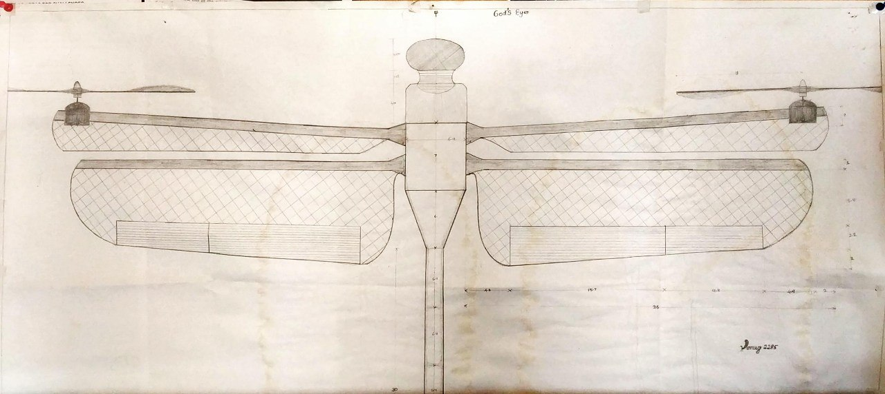

Hey there! 👋 I'm Pranesh Selvaraj, a passionate developer and programmer based in Siegen, Germany. Welcome to my GitHub portfolio.

## 🚀 About Me

- 🌐 Fullstack Web Developer (MEVN • React)
- 🛠️ Full Stack / DevOps Engineer @ Universität Siegen (Apr 2024 – Present)
- 🤖 AI Enthusiast (especially AI-assisted workflows)
- 🕶️ VR/AR Enthusiast
- 🌌 Curious explorer of the Metaverse & Blockchain

## 🛠️ Skills

- 💻 Programming: JavaScript, Python, C/C++, C#, SQL, HTML, CSS, YAML
- 🧰 Technologies: MongoDB, Express.js, Vue.js, Node.js, React, Django, Docker, Kubernetes, OpenShift, Ansible, REST APIs, GitLab CI/CD
- 🎨 Tools: Linux, GitHub, GitLab, Figma, Visual Studio, Unity, Fusion 360
- 📝 Docs & Presentation: Swagger, Markdown, LaTeX, Google Workspace, LibreOffice, Canva

## 🎓 Education

- 🎓 **M.Sc. Human-Computer Interaction** — University of Siegen, Germany (Apr 2023 – Apr 2026)
  - 📌 GPA: 2.0
- 🎓 **B.Eng. Electronics & Communication Engineering** — Sri Eshwar College of Engineering, India (Jun 2018 – May 2022)
  - 📌 Cum. GPA: 8.34 / 10.0

## 📂 Projects

Here are some highlights of my work (click around — I love sharing project details 😄):

1. **CryptLearn** 🔐📚
   - **Duration:** Sep 2025 – Apr 2026
   - **Affiliation:** University of Siegen
   - **Description:**
     Built a full-stack e-learning platform for cryptography with authentication, dashboards, progress tracking, badges, and live encryption/decryption tools.
   - **Focus:** Secure REST APIs (JWT), CRUD, MongoDB, responsive React UI
   - **Tools:** React, Vite, Node.js, Express, MongoDB, JWT, Tailwind CSS

2. **Hilfegeschichten** 🤝🗞️
   - **Duration:** May 2024 – Sep 2024
   - **Affiliation:** University of Siegen
   - **Description:**
     Migrated an underdeveloped Laravel/PHP prototype to WordPress and delivered a stable community platform for foreigners and elders in Siegen (with user management, database integration, and a timeline feed).
   - **Tools:** WordPress, PHP, MySQL, Elementor

3. **Immersive KitchenVR Slicing Simulator** 🥽🔪
   - **Duration:** Nov 2023 – Feb 2024
   - **Affiliation:** University of Siegen
   - **Description:**
     Developed a Unity VR simulation with realistic slicing mechanics, physics-based interactions, and immersive kitchen scenarios (XR Interaction Toolkit).
   - **Tools:** Unity, C#, MetaQuest, Visual Studio
   - View the source code here: https://github.com/Pranesh-Selvaraj/KitchenVR-Simulator

4. **Smart Coaster** ☕💳
   - **Duration:** Jun 2023 – Sep 2023
   - **Affiliation:** University of Siegen
   - **Description:**
     Integrated a smart coaster prototype with a POS system and digital payment workflow to enable seamless ordering and payment.
   - **Tools:** Python, Linux, Django, HTML, CSS, JavaScript, API
   - View the source code here: https://github.com/Pranesh-Selvaraj/SmartCoaster-repo

5. **God's Eye** ✈️🛰️
   - **Duration:** Dec 2019 – Jul 2020
   - **Affiliation:** Sri Eshwar College of Engineering
   - **Description:**
     Built an autonomous aircraft prototype for disaster identification and alerting. Designed and validated a bio-inspired flight concept; finalist (internal) at Smart India Hackathon 2020.
   - **Tools:** Solidworks, Linux, ROS Melodic Morenia, Python

   

    
    
    
   

## 📚 Publications

- 🧠 **Master’s Thesis (2026)** — *AI-Assisted Web Development: Evaluating the Accuracy and Efficiency of Figma-to-Code AI Tools* (University of Siegen)
- 📄 **Conference Paper (2023)** — *Design of Hybrid UAV With Multi Rotor Propulsion System* (ICACCS 2023)
  - DOI: https://doi.org/10.1109/ICACCS57279.2023.10113123

## 🎯 A few fun things about me

Apart from coding, I enjoy playing volleyball, swimming, and diving into good books. Video games sometimes 😜

## 📫 Let's Connect

- 🌐 Website: https://pranesh-selvaraj.vercel.app/
- 💼 LinkedIn: https://www.linkedin.com/in/pranesh-selvaraj/
- 💻 GitHub: https://github.com/Pranesh-Selvaraj
- 📧 Email: pranesh.selvaraj@zohomail.eu

Thanks for stopping by! Feel free to explore my projects and reach out if you have any questions or collaborations in mind 🚀