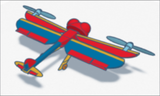
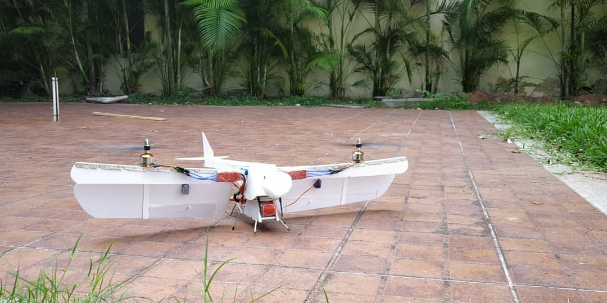
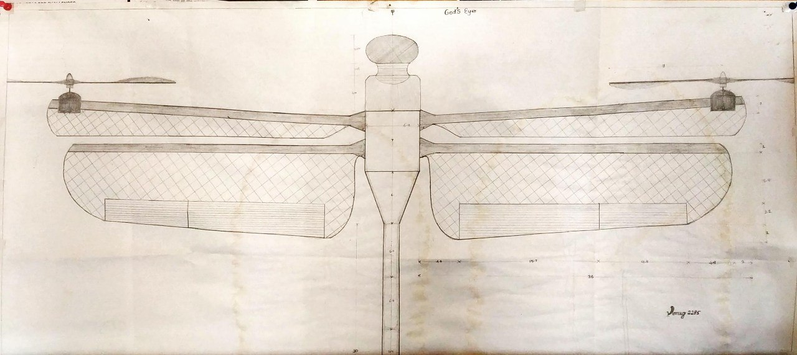

Hey there! 👋 I'm Pranesh Selvaraj, a passionate developer and programmer based in Siegen, Germany. Welcome to my GitHub portfolio.

## 🚀 About Me

- 🌐 Fullstack Web Developer
- 🤖 AI Enthusiast
- 🌌 Exploring the Metaverse and Bloackchain
- 🕶️ VR/AR Enthusiast

## 🛠️ Skills

- 💻 Programming: Python, JavaScript, C#, C/C++, HTML, CSS, SQL
- 🖥️ Technologies: Django, React, MongoDB, Express.js, Vue.js, Node.js, Docker
- 📱 VR/AR: Unity, C#
- ⚙️ Other: Machine Learning, CI/CD, Fusion360 3D Modelling

## 📂 Projects

Here are some highlights of my work:

1. **God's Eye**
   - **Duration:** Dec 2019 - Jul 2020
   - **Affiliation:** Sri Eshwar College of Engineering
   - **Description:**
     The objective of this project was to build an autonomous aircraft for disaster identification and alerting system. Our team designed a unique flight system inspired by the anatomy of the dragonfly. We presented "God's Eye" in an Internal hackathon for SIH 2020 and qualified as finalists in the Smart India Hackathon (SIH) 2020 organized by the Government of India.
   - **Skills:** Robot Operating System (ROS) · SOLIDWORKS · Linux · Drone Building · Drone Piloting · Computer Vision · Python (Programming Language)
    

     
     
     
   

2. **Smart Coaster**
   - **Duration:** Jun 2023 - Oct 2023
   - **Affiliation:** Universität Siegen
   - **Description:**
     Our project aims to incorporate an existing smart coaster prototype with a Point of Sale (POS) system and payment options to enhance restaurant food order management and improve customer experiences. This will enrich customer experiences in the hospitality industry. By enabling easy food and beverage ordering and payment, our smart coaster solution is expected to increase guest satisfaction and streamline operations.
   - **Skills:** Django · HTML5 · Application Programming Interfaces (API) · Linux · Python (Programming Language) · Cascading Style Sheets (CSS)
   - View the source code here: [Pranesh-Selvaraj/SmartCoaster-repo](https://github.com/Pranesh-Selvaraj/SmartCoaster-repo.git)
3. ** Immersive KitchenVR Simulator**
   - **Duration:** Nov 2023 - Feb 2024
   - **Affiliation:** Universität Siegen
   - **Description:**
      ImmersiveKitchenVRSlicingSimulatoris acutting-edgeUnityVRproject, showcasingrealistic physics and dynamicinteractions for slicing and dicing in avibrant kitchen environment. Theexperiencehighlightstechnical proficiency withUnity, XRInteraction Toolkit, and offers an engaging, lifelike virtual culinary journey.
   - **Skills:**  Unity · C# · MetaQuest · Cross-Platform development · Visual Studio
   - View the source code here: [Pranesh-Selvaraj/SmartCoaster-repo](https://github.com/Pranesh-Selvaraj/SmartCoaster-repo.git)

## 📚 Hobbies

Apart from coding, I enjoy playing volleyball, swimming and diving into good books. Video games sometimes😜

## 📫 Let's Connect

- LinkedIn: [Pranesh Selvaraj](https://www.linkedin.com/in/pranesh-selvaraj/)
- Email: praneshs281@gmail.com

Thanks for stopping by! Feel free to explore my projects and reach out if you have any questions or collaborations in mind.

